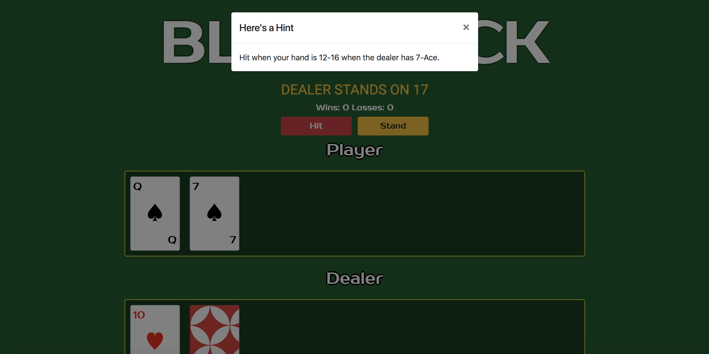

Contributors
Natalie Todd natalie.todd15@gmail.com https://www.linkedin.com/in/natalie-todd/

Learn Blackjack Description
Learn Blackjack allows a user to play Blackjack against a computer dealer. The player is offered hints if they take more than five seconds to decide on their next move.

The Problem
There isn't an application that gives users hints when playing Blackjack.

How does Learn Blackjack solve this problem?
Blackjack is geared toward players who are not already familiar with Blackjack in that it offers hints.

Tech used
React, Redux, Firebase

Instructions
1. Fork and clone repo to local directory
2. $ cd blackjackfront
3. npm install
4. npm start
Learn Blackjack Deployed Link
https://blackjack-b5b12.firebaseapp.com/

Learn Blackjack Github Repo
https://github.com/natalie-todd/travelBugFrontend2/blob/master/intro-vue/README.md

